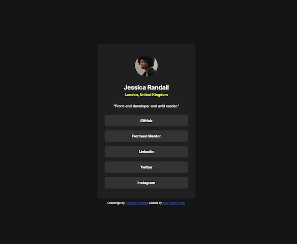
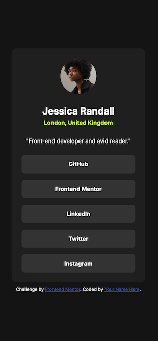

# Frontend Mentor - Social links profile solution

This is a solution to the [Social links profile challenge on Frontend Mentor](https://www.frontendmentor.io/challenges/social-links-profile-UG32l9m6dQ). Frontend Mentor challenges help you improve your coding skills by building realistic projects. 

## Table of contents

- [Overview](#overview)
  - [The challenge](#the-challenge)
  - [Screenshot](#screenshot)
  - [Links](#links)
- [My process](#my-process)
  - [Built with](#built-with)
  - [What I learned](#what-i-learned)
  - [Useful resources](#useful-resources)
  - [AI Collaboration](#ai-collaboration)
- [Author](#author)

## Overview

### The challenge

Users should be able to:

- See hover and focus states for all interactive elements on the page

### Screenshot
PC

SP

### Links

updated later

## My process

### Built with

- Semantic HTML5 markup
- CSS custom properties
- Flexbox
- Mobile-first workflow
- JS

### What I learned

I forgot most of the syntaxs of JS. This was a good start to learn JS once again.

### Useful resources

- [W3School](https://www.w3schools.com/) : amazing page for beginner who wants to learn the basic as well as search for syntax and how to use

### AI Collaboration

I haven't used AI for this challenge

## Author

- Frontend Mentor - [DucNguyenJP89](https://www.frontendmentor.io/profile/DucNguyenJP89)
